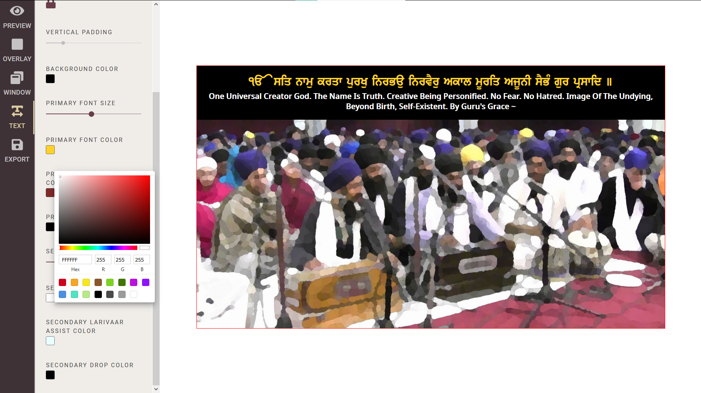
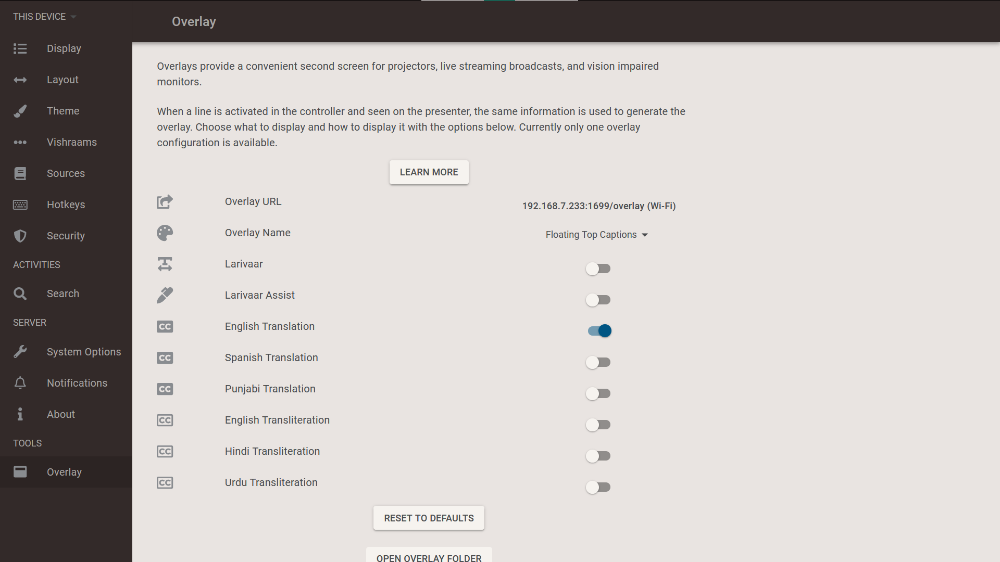

# Theme Tool

Overlay generator for Shabad OS Presenter. [Create a custom live stream overlay >](https://themes.shabados.com/)

[![Release][release-image]][release-url]
[![Next Release][next-image]][next-url]

- [Introduction](#introduction)
  - [Features](#features)
  - [Screenshots](#screenshots)
    - [Changing text color in Theme Tool](#changing-text-color-in-theme-tool)
    - [Viewing Overlay settings in Presenter](#viewing-overlay-settings-in-presenter)
    - [Example Live Stream with Overlay captions](#example-live-stream-with-overlay-captions)
- [Community](#community)
- [Contributing](#contributing)
- [People](#people)
- [Feedback](#feedback)
- [Related Projects](#related-projects)
- [Code of Conduct](#code-of-conduct)
- [License](#license)

## Introduction

The Shabad OS Theme Tool is an open source project with ongoing development, project management, and marketing made possible entirely by the support and dedication of unpaid volunteers.

This web app allows users to customize and generate overlays in Shabad OS Presenter. Overlays are in sync with the presenter, so what is displayed there will also show up in the overlay. Overlays should be used in live streaming software to add gurbani and/or english, hindi, punjabi translations / pronunciations.

See:

- [Our Website][website-url]
- [How to install Presenter](https://tutorials.shabados.com/tutorials/1.0.0/basics/install.html)
- [How to add live stream captions](https://tutorials.shabados.com/tutorials/1.0.0/overlay/add-live-streaming-captioning.html)

### Features

- Customization of the:
  - Overlay size and position
  - Text size, color, and shadows
- Preview for various platforms including TVs, Facebook, Instagram, and alternate YouTube resolutions
- Overlay generator / file export, to be used in Shabad OS Presenter

### Screenshots

#### Changing text color in [Theme Tool](https://themes.shabados.com/)

#### Viewing Overlay settings in [Presenter](https://github.com/shabados/presenter)

#### Example Live Stream with Overlay captions

## Community

Get updates on Shabad OS and chat with the project maintainers and community members.

- [![Instagram][instagram-image]][instagram-url] Follow Shabad OS on Instagram
- [![Twitter][twitter-image]][twitter-url] Follow Shabad OS on Twitter.
- [![Chat][chat-image]][chat-url] Join the official Slack channel.

## Contributing

There are multiple ways to contribute whether you are a user or developer. For example:

- [Submit bugs and feature requests][new-issue-url].
- Review documentation and make pull requests for anything from typos to new content.
- Give feedback on the onboarding process to make it easier for others to join the project.

If you're interested in contributing to the source code of Theme Tool, then please see [Contributing Guidelines](./CONTRIBUTING.md).

## People

The original author is Saihaj Singh ([@saihaj](https://github.com/saihaj)).

The current lead maintainer is Harjot Singh ([@harjot1singh](https://github.com/harjot1singh)).

"Thank you!" to [all the volunteers][contributor-url] who've contributed to Theme Tool.

## Feedback

- Ask questions and get help in our community chat via [Slack][chat-url]
- [Upvote popular feature requests][upvote-tracker-url] using the thumbs-up/+1 reaction on the first post of a feature request
- Follow [@shabad_os on Instagram](instagram-url) and [@shabad_os on Twitter](twitter-url) and let us know what you think!

## Related Projects

Projects in the Shabad OS ecosystem of free and open source software include:

- [Database](https://github.com/shabados/database)
- [Viewer](https://github.com/shabados/viewer)
- [Presenter](https://github.com/shabados/presenter)
- [Mobile](https://github.com/shabados/mobile)
- [Gurmukhi Utils](https://github.com/shabados/gurmukhi-utils)

## Code of Conduct

Please note that this project is released under the Contributor Covenant. By participating in this project you agree to abide by its terms. Our intention is to signal a safe open-source community by welcoming all people to contribute, and pledging in return to value them as whole human beings and to foster an atmosphere of kindness, cooperation, and understanding.

> We as members, contributors, and leaders pledge to make participation in our community a harassment-free experience for everyone, regardless of age, body size, visible or invisible disability, ethnicity, sex characteristics, gender identity and expression, level of experience, education, socio-economic status, nationality, personal appearance, race, religion, or sexual identity and orientation.
>
> We pledge to act and interact in ways that contribute to an open, welcoming, diverse, inclusive, and healthy community.
>
> [The Contributor Covenant][contributor-covenant-url]

## License

This project is under v3 of the [GPL](LICENSE.md). It is similar to the Golden Rule: do unto others as you would have them do unto you. In exchange for benefitting from the work completed in this repo, others must share their derivative work under v3 of the [GPL](LICENSE.md).

> This program is free software: you can redistribute it and/or modify it under the terms of the GNU General Public License as published by the Free Software Foundation, either version 3 of the License, or (at your option) any later version.
>
> This program is distributed in the hope that it will be useful, but WITHOUT ANY WARRANTY; without even the implied warranty of MERCHANTABILITY or FITNESS FOR A PARTICULAR PURPOSE. See the GNU General Public License for more details.
>
> You should have received a copy of the GNU General Public License along with this program. If not, see <https://www.gnu.org/licenses/>.

[release-image]: https://img.shields.io/github/workflow/status/shabados/theme-tool/Build%20and%20Deploy/master.svg?label=release
[release-url]: https://github.com/shabados/theme-tool/actions?query=workflow%3A%22Build+and+Deploy%22+branch%3Amaster
[next-image]: https://img.shields.io/github/workflow/status/shabados/theme-tool/Build%20and%20Deploy/dev.svg?label=next%20release
[next-url]: https://github.com/shabados/theme-tool/actions?query=workflow%3A%22Build+and+Deploy%22+branch%3Adev
[website-url]: https://shabados.com
[instagram-image]: https://img.shields.io/badge/Instagram-%40shabad__os-C13584.svg?logo=instagram&logoColor=white
[instagram-url]: https://www.instagram.com/shabad_os/
[twitter-image]: https://img.shields.io/badge/Twitter-%40shabad__os-1DA1F2.svg?logo=twitter&logoColor=white
[twitter-url]: https://www.twitter.com/shabad_os/
[chat-image]: https://img.shields.io/badge/Chat-Public%20Slack%20Channels-1264a3.svg?logo=slack
[chat-url]: https://chat.shabados.com
[new-issue-url]: https://github.com/shabados/theme-tool/issues/new/choose
[contributor-url]: https://github.com/shabados/theme-tool/graphs/contributors
[upvote-tracker-url]: https://github.com/shabados/theme-tool/issues?q=is%3Aopen+is%3Aissue+label%3A%22Type%3A+Feature%2FEnhancement%22+sort%3Areactions-%2B1-desc
[contributor-covenant-url]: https://www.contributor-covenant.org/version/2/0/code_of_conduct/
